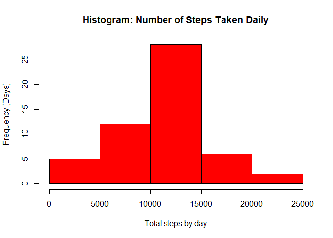
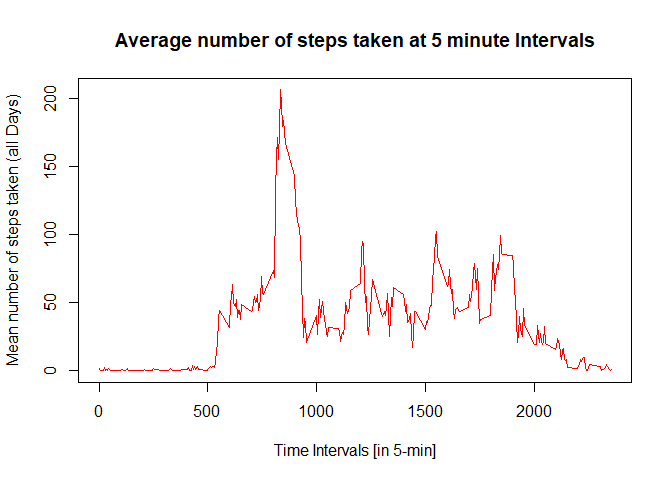
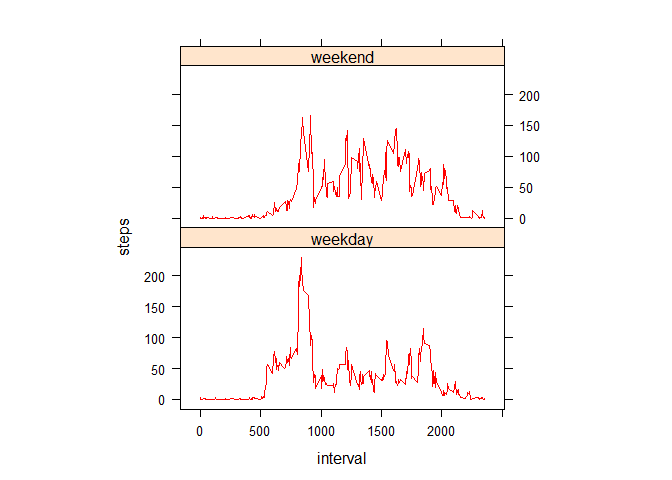

<br/>

#### **Loading and preprocessing the data**

###### **Load the data (i.e. read.csv()).**

```r
activityData <- read.csv ("activity.csv", header = T, sep = ",", stringsAsFactors = F)
```

###### **Process/transform the data (if necessary) into a format suitable for your analysis.**

```r
activityData$date <- as.Date(activityData$date, "%Y-%m-%d")
```

<br/>

#### **What is mean total number of steps taken per day?**

###### **Calculate the total number of steps taken per day.**

```r
totalSteps <- aggregate(steps ~ date, activityData, sum, na.rm = TRUE)
```

###### **If you do not understand the difference between a histogram and a barplot, research the difference between them. Make a histogram of the total number of steps taken each day.**

```r
hist(totalSteps$steps, xlab = "Total steps by day", ylab = "Frequency [Days]", 
     main = "Histogram: Number of Steps Taken Daily", col = "red")
```

<!-- -->

###### **Calculate and report the mean and median of the total number of steps taken per day.**

```r
meanSteps <- mean(totalSteps$steps)
print(meanSteps)
```

```
## [1] 10766.19
```

```r
medianSteps <- median(totalSteps$steps)
print(medianSteps)
```

```
## [1] 10765
```

<br/>

#### **What is the average daily activity pattern?**

###### **Make a time series plot (i.e. type="l") of the 5-minute interval (x-axis) and the average number of steps taken, averaged across all days (y-axis).**

```r
stepsInterval <- aggregate(steps ~ interval, data = activityData, FUN = mean)
plot(stepsInterval, type = "l", col = "red", xlab = "Time Intervals [in 5-min]", 
     ylab = "Mean number of steps taken (all Days)",
     main = "Average number of steps taken at 5 minute Intervals")
```

<!-- -->

###### **Which 5-minute interval, on average across all the days in the dataset, contains the maximum number of steps?**

```r
maxStepInterval <- stepsInterval$interval[which.max(stepsInterval$steps)]
print(maxStepInterval)
```

```
## [1] 835
```

<br/>

#### **Imputing missing values**
Each missing value is filled with the mean steps for the corresponding interval index which is returned by the function ```getMeanStepsPerInterval```. We create a new dataset ```completeActivityData``` which has the missing data of the original dataset filled in.

###### **Calculate and report the total number of missing values in the dataset (i.e. the total number of rows with NAs).**

```r
missingRows <- sum(is.na(activityData))
print(missingRows)
```

```
## [1] 2304
```

###### **Devise a strategy for filling in all of the missing values in the dataset. The strategy does not need to be sophisticated. For example, you could use the mean/median for that day, or the mean for that 5-minute interval, etc.**

```r
## This function returns the mean steps for a given interval
getMeanStepsPerInterval <- function(interval) {
  stepsInterval$steps[stepsInterval$interval==interval]
}
```

###### **Create a new dataset that is equal to the original dataset but with the missing data filled in.**

```r
completeActivityData <- activityData
for (i in 1:nrow(completeActivityData)) {
  if (is.na(completeActivityData[i, "steps"])) {
    completeActivityData[i, "steps"] <- getMeanStepsPerInterval(completeActivityData[i, "interval"])
  }
}
```

###### **Make a histogram of the total number of steps taken each day and Calculate and report the mean and median total number of steps taken per day. Do these values differ from the estimates from the first part of the assignment? What is the impact of imputing missing data on the estimates of the total daily number of steps?**

```r
totalStepsPerDays <- aggregate(steps ~ date, data = completeActivityData, sum)
hist(totalStepsPerDays$steps, col = "red", xlab = "Total steps by day", 
     ylab = "Frequency [Days]", main = "Histogram : Number of daily steps")
```

<!-- -->

```r
newMean <- mean(totalStepsPerDays$steps)
print(newMean)
```

```
## [1] 10766.19
```

```r
newMedian <- median(totalStepsPerDays$steps)
print(newMedian)
```

```
## [1] 10766.19
```

The mean value is the same as the value before imputing missing data, but the median value has changed.
<br/>
Since the mean value has been used for that particular 5-min interval, it is the same as the value before imputing missing data. Since the median index is now being changed after imputing missing values, the median value is different.

<br/>

#### **Are there differences in activity patterns between weekdays and weekends?**

###### **Create a new factor variable in the dataset with two levels - "weekday" and "weekend" indicating whether a given date is a weekday or weekend day.**

```r
completeActivityData$day <- ifelse(as.POSIXlt(as.Date(completeActivityData$date))$wday%%6 == 0, "weekend", "weekday")
completeActivityData$day <- factor(completeActivityData$day, levels = c("weekday", "weekend"))
```

###### **Make a panel plot containing a time series plot (i.e. type = "l") of the 5-minute interval (x-axis) and the average number of steps taken, averaged across all weekday days or weekend days (y-axis). See the README file in the GitHub repository to see an example of what this plot should look like using simulated data.**

```r
library(lattice)

stepsInterval= aggregate(steps ~ interval + day, completeActivityData, mean)
xyplot(steps ~ interval | factor(day), data = stepsInterval, aspect = 1/2, type = "l", col = "red")
```

<!-- -->
